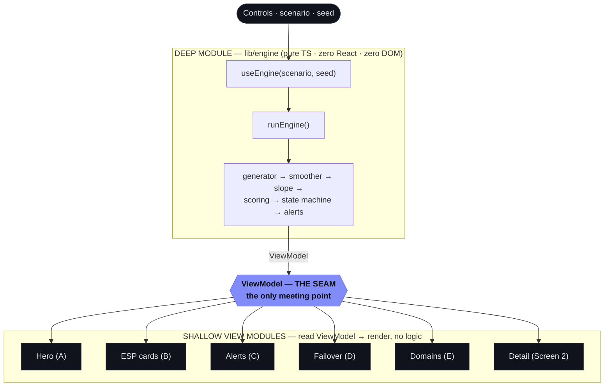

# dEWSentinel — Deliverability Early-Warning Console

*We see the dip before your reply rates do.*

A client-side console that **computes** (not fakes) per-ESP email-deliverability **health** from seeded,
synthetic data and renders the full early-warning story: silent reputation decay surfaced **early** from
leading signals, projected to the complaint cliff, and driven through an automatic failover playbook.

**▶ Live app:** **https://dewsentinel.vercel.app/**

**🪧 Pitch deck:** **https://dewsentinel-deck.vercel.app/**

> **Simulated data.** The *engine and visuals are real*; the data is synthetic. In production, leading
> signals come from a sending platform's own MTA accounting-webhook telemetry (bounces, deferrals,
> 4xx/5xx provider codes), confirmed by Google Postmaster + Microsoft SNDS. This is shown as a
> persistent label in the UI footer.

---

## What it shows

A Gmail sending domain decays silently over 30 days while the "old dashboard" (a lagging warmup/placement
proxy) stays green — until the cliff. dEWSentinel surfaces the decay **early** from leading signals,
**per inbox provider** (Gmail vs Outlook), projects the trend to the 0.30% complaint cliff, and drives an
automatic `Healthy → Watch → Throttle → Failover → Cooldown` playbook with a hot-standby pool.

- **Hero (lead-time view)** — a single 0–100 **health** line that *falls* through HEALTHY → WATCH → DANGER
  zones, with a flat-green "today's dashboard" strip beside it and a shaded **"≈ N days of warning gained"**
  band spanning when Sentinel warned vs when the lagging tools would finally react.
- **Per-ESP cards** — ring gauge, smoothed complaint rate + 90% CI, position on the 0.10%→0.30% band, and a
  projection (*"crosses 0.30% cliff in ~N days"*).
- **Failover + standby pool** — the live stage of the playbook and the hot-standby domains ready to take over.
- **Domain detail (drill-down)** — raw (jagged, spiking past the cliff) vs Beta-Binomial smoothed rate +
  confidence band, the alert marker where smoothing crosses 0.10%, and the weighted signal breakdown.

A **Critical ⇄ Healthy** toggle and a **seed** input let you reshuffle the synthetic noise on camera and
prove the render is deterministic — same seed ⇒ identical render.

---

## Run it

The app lives in [`app/`](./app) (Next.js 16 + TypeScript).

```bash
cd app
npm install
npm run dev        # → http://localhost:3000
```

Other scripts:

```bash
npm test           # Vitest + React Testing Library (101 tests)
npm run typecheck  # tsc --noEmit
npm run build      # next build
```

---

## Architecture — one deep module, one seam, shallow views

Every displayed number is **derived by the engine**; nothing in the UI is hardcoded. The engine and the UI
meet at exactly one place: the `ViewModel` contract.



| Layer | Responsibility |
|---|---|
| **`lib/engine/`** | **Pure logic, zero DOM.** Seeded RNG → synthetic generator → Beta-Binomial smoothing → least-squares slope/projection → per-ESP weighted scoring → lagging "dashboard" proxy → failover state machine → alerts. Exposes one function: `runEngine({scenario, seed, days, today}) → ViewModel`. Internals are hidden; the engine is tested **only** through the ViewModel. |
| **`components/`** | **Render only, zero business logic.** Each zone reads its `ViewModel` slice and renders it; charts are rebuilt from ViewModel arrays as data-driven SVG. |
| **`viewmodel.ts`** | **The seam.** The single contract between logic and render. The model is **health** (0–100, down = danger) — there is no "risk" number anywhere in the UI. |

**Determinism is a hard requirement:** same `seed` ⇒ identical `ViewModel` ⇒ identical render. No
`Date.now()` / `Math.random()` outside the seeded RNG; no network; no storage.

---

## Tech stack

| | |
|---|---|
| **Framework** | Next.js 16 (App Router) · React 19 |
| **Language** | TypeScript 5 (strict) |
| **Charts** | Hand-built, data-driven inline SVG (no chart library) |
| **Fonts** | IBM Plex Sans + Mono, self-hosted as base64 (zero CDN/font requests) |
| **Testing** | Vitest + React Testing Library + jsdom — 101 tests |
| **Math** | Seeded RNG · Beta-Binomial smoothing + 90% credible interval · least-squares slope/projection |
| **Deploy** | Vercel (Root Directory = `app`); auto Preview per push, `main` → production |

---

## Key metrics (default load — `scenario: critical`, `seed: 42`)

End-to-end acceptance is verified through the real Console in `app/app/acceptance.test.tsx`:

| Signal | Value |
|---|---|
| Gmail card | **critical**, score **27** |
| Outlook card | **healthy**, score **96** |
| Lagging "dashboard" strip | flat green **96** across the whole window |
| Warning gained (Sentinel vs lagging tools) | **≈ 10 days** |
| Failover playbook | at the pulsing **Failover** stage |
| Healthy toggle (seed 42) | both gauges green — Gmail **92**, Outlook **93** |
| Determinism | two fresh renders at the default seed → byte-identical DOM |
| Honesty label | the "Simulated data." footer shows on **both** screens |

---

## Roadmap

- **v0 (this):** engine + console on synthetic, deterministic data.
- **v1:** ingest live MTA accounting-webhook telemetry + Google Postmaster / Microsoft SNDS for one ESP; real alerting.
- **v2:** automated failover execution + standby-pool orchestration.

---

<sub>The original vanilla-JS proof-of-concept (no build step, single static folder) lives in
[`demo/`](./demo) and remains the conceptual reference for the engine ported to TypeScript in `app/`.</sub>
