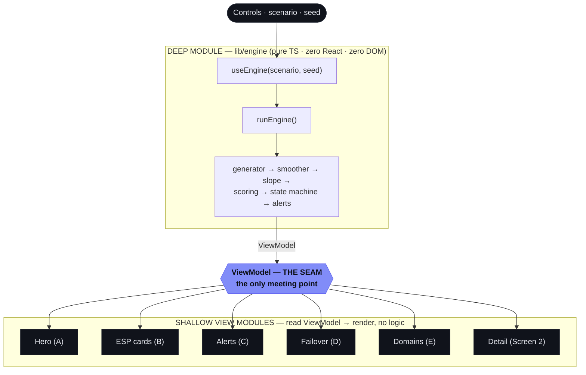
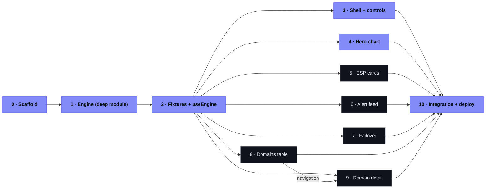

# React / Next.js build plan — dEWSentinel

**Audience:** an AI coding agent picking this up cold, later, with no other context.
**Goal:** port the working vanilla POC in [`/demo`](../demo) to a React + Next.js app,
**test-first**, preserving the engine's behaviour exactly and the UI's look faithfully.

> Read these first, in order: [`CONTEXT.md`](../CONTEXT.md) (the domain language —
> **non-negotiable for naming**), [`spec/ENGINE_SPEC.md`](./ENGINE_SPEC.md) (engine +
> ViewModel + acceptance §10), [`spec/HANDOFF_SPEC.md`](./HANDOFF_SPEC.md) (UI, zones,
> design tokens). The existing [`/demo`](../demo) is your **behaviour oracle** — when a
> number is ambiguous, the POC's output for `seed 42` is ground truth.

---

## 0. Ground rules (apply to every slice)

1. **TDD, vertical slices.** One test → minimal code to pass → next test. **Never**
   write all tests then all code (that produces tests of imagined behaviour). Refactor
   only when green.
2. **Test through the interface, never internals.** The engine's interface is the
   **ViewModel** returned by `runEngine`; assert on that, not on private helpers. A UI
   component's interface is the DOM it renders from a given ViewModel; assert on that.
   A test that breaks on an internal rename was testing the wrong thing.
3. **Name tests in the domain language.** Use `CONTEXT.md` vocabulary: *health* (never
   *risk*) for scores, *watch line* = health 80, *cliff* = health 40, *crossWatchDay*,
   *warningGainedDays*, *leading/lagging*. See `CONTEXT.md` → "Writing tests in this
   language" for good/bad examples.
4. **Deep module discipline** (from `codebase-design`): keep the engine's interface
   tiny (`runEngine(opts) → ViewModel`) and its implementation hidden. The UI layer has
   **zero business logic** — it only reads the ViewModel. They meet **only** at the
   ViewModel seam. If a component needs to compute a displayed number, that number
   belongs in the engine instead.
5. **Determinism is a hard requirement.** Same `seed` ⇒ identical ViewModel ⇒ identical
   render. No `Date.now()`/`Math.random()` outside the seeded RNG. No `localStorage`,
   no network, no backend.
6. **Charts are data-driven, not ported SVG.** Do **not** copy the mockup's hardcoded
   SVG coordinates. Rebuild each chart from the ViewModel arrays (see stack note on the
   charting choice).
7. **Keep the honesty label** (ENGINE_SPEC §11) visible at all times.

---

## 1. Recommended stack

| Concern | Choice | Why |
|---|---|---|
| Framework | **Next.js (App Router) + TypeScript** | Per the brief; client-side only — pages are client components (`"use client"`). |
| Test runner | **Vitest + React Testing Library + jsdom** | Fast, ESM-native, engine tests run as plain Node. (Jest is acceptable if preferred.) |
| Styling | **CSS variables (token file) + CSS Modules** | Mirrors the spec's design-token approach 1:1; no utility-class translation layer. (Tailwind is acceptable if its theme is wired to the same tokens.) |
| Charts | **visx** (d3 primitives) for the bespoke hero + raw/smoothed charts; simple SVG for gauges/sparklines | The hero's stacked zones, warning band, event markers, and dashed projection need full control. visx counts as "a real charting library" (satisfies HANDOFF) while giving that control. Recharts/ECharts are viable but fight the custom annotations. **← confirm this choice before Slice 4.** |

Everything else (folder names, component granularity) is the executing agent's call,
within the architecture below.

---

## 2. Architecture — one deep module, one seam, shallow views



- **The engine ports almost verbatim.** [`demo/engine.js`](../demo/engine.js) is already
  pure and DOM-free. Translate it to TypeScript under `lib/engine/`, give the ViewModel
  real types, and pin its behaviour with tests (Slice 1). This is the highest-leverage,
  most-testable work — do it first.
- **The UI seam in React** is a single hook, `useEngine(scenario, seed) → ViewModel`.
  Every zone reads its slice of that object. Because the seam is the ViewModel, the six
  view slices (4–9) can be built **in parallel by independent agents** against a shared
  ViewModel fixture (Slice 2) — they never touch engine internals or each other.
- **The ViewModel contract is frozen in ENGINE_SPEC §8.** Note the current field names
  are *health* (`healthSeries`, `healthProjSeries`, `watchHealth=80`, `dangerHealth=40`)
  — the old `risk*` names are stale (see CONTEXT.md → Decisions).

### Target layout

```
app/
  layout.tsx            # fonts (IBM Plex Sans/Mono), global tokens, <body>
  page.tsx              # Console (Screen 1); holds scenario/seed/selectedDomain state
  globals.css           # tokens.css import + resets
lib/engine/
  index.ts             # runEngine(opts) → ViewModel   (the only export the UI uses)
  rng.ts smoothing.ts slope.ts scoring.ts stateMachine.ts generator.ts  # internal
  viewmodel.ts         # ViewModel + EspCard + Alert + DomainRow types
components/
  console/   Hero/ EspCard/ AlertFeed/ Failover/ DomainsTable/
  detail/    DomainDetail/ RawVsSmoothedChart/ SignalBreakdown/ RecommendedAction/
  charts/    LineChart/ GaugeRing/ Sparkline/      # data-driven, reusable
  useEngine.ts
styles/ tokens.css      # every hex from HANDOFF "Design Tokens" as CSS variables
test/ fixtures/viewmodel.critical.ts  viewmodel.healthy.ts
```

---

## 3. The slices

Each slice is **independently grabbable**: it lists its preconditions, the interface it
owns, the red→green cycles (each bullet = one failing test then minimal code), what
"done" means, and how to verify. Work the cycles top-to-bottom.

### Slice 0 — Scaffold & test harness  ·  _blocks everything_
- **Pre:** none.
- **Do:** `create-next-app` (TS, App Router); add Vitest + RTL + jsdom; add IBM Plex
  Sans/Mono (self-hosted, no CDN — match the POC's zero-network rule); create
  `styles/tokens.css` from HANDOFF "Design Tokens"; render the dark app shell.
- **Tracer-bullet test:** a smoke test renders `<Home/>` and finds the persistent
  "Simulated data…" label (ENGINE_SPEC §11). RED (no label) → GREEN (shell + label).
- **Done:** `npm test` and `npm run dev` both work; shell shows the dark theme + label.

### Slice 1 — Engine as a deep module  ·  _blocks all UI slices_
- **Pre:** Slice 0.
- **Interface:** `runEngine({scenario?, seed?, days?, today?}) → ViewModel` (ENGINE_SPEC
  §5.8, §8). Keep internals (rng, smoothing, slope, scoring, state machine, generator)
  unexported.
- **Oracle:** port the logic from `demo/engine.js`; lift its §10 self-check assertions as
  your first tests. Reference impls for RNG/smoothing/slope are in ENGINE_SPEC §5.1–5.3 —
  copy them exactly (incl. the normal-approx Beta; do **not** write an exact beta inverse).
- **Red→green cycles (assert on the ViewModel only):**
  - `runEngine()` defaults to `scenario:"critical", seed:42` and returns a ViewModel with
    the §8 shape.
  - **Determinism:** two calls with the same seed deep-equal; different seeds differ.
  - **Critical Gmail:** `esp.gmail.score < 40`, tier `critical`; smoothed rate ~0.17–0.25%.
  - **Critical Outlook:** `esp.outlook.score >= 80`, tier `healthy`, projection "stable".
  - **Hero agrees with the card:** `leadTime.healthSeries[today] === esp.gmail.score`.
  - **Lead-time:** `healthSeries` starts ≥80 and ends in DANGER (<40); `crossWatchDay` =
    first day health < `watchHealth` (80); `warningGainedDays >= 7`.
  - **Projection:** `healthProjSeries.length === projDays` (5), declining, clamped [0,100].
  - **Smoothing ignores spikes:** injecting a single-complaint spike doesn't move the
    smoothed series past the watch line on that day.
  - **`daysToThreshold`** is `Infinity` when the smoothed slope ≤ 0.
  - **State machine** (ENGINE_SPEC §5.6): Gmail resolves to `Failover`; thresholds map
    score+projection → stage; standby pool has 3 all-green domains.
  - **Healthy scenario (calm):** both ESPs stay ≥80 (health never < watch);
    `warningGainedDays === 0`; alerts are all green; failover at `Healthy`.
- **Refactor:** once green, extract the internal helpers behind `index.ts`; confirm the
  interface stayed tiny (one function, one options object, one ViewModel out).
- **Done:** all behaviour tests green; `lib/engine` exports only `runEngine` + types.

### Slice 2 — ViewModel fixtures & `useEngine`  ·  _blocks UI slices_
- **Pre:** Slice 1.
- **Do:** snapshot `runEngine({scenario:"critical",seed:42})` and the healthy variant into
  `test/fixtures/`; implement `useEngine(scenario, seed)` returning the live ViewModel.
- **Test:** `useEngine` re-computes when scenario/seed change and is referentially stable
  otherwise.
- **Done:** UI slices can import a fixture and render in isolation.

> Slices 4–9 each depend only on **Slice 2** and are mutually independent — assign one
> agent per slice and run them concurrently. Each reads its named ViewModel fields and
> renders into its zone; none imports another component or the engine internals.

### Slice 3 — App shell, top bar, controls  ·  _enables live app_
- **Pre:** Slice 2.
- **Cycles:** top bar shows `meta.account` + `domainCount`, `globalStatus` pill (blinking
  red dot when red), `lastSyncedMin`. `#scenario-toggle` flips critical⇄healthy and
  re-renders via `useEngine`. `#seed-input` re-runs on change/Enter (no replay button —
  see CONTEXT Decisions). Honesty label persists.
- **Done:** controls drive the whole page through the hook; toggling re-renders all zones.

### Slice 4 — Hero health chart (Zone A)  ·  _the money shot_
- **Pre:** Slice 2 (+ charting choice confirmed). **Reads:** `leadTime.*`.
- **Cycles (HANDOFF Zone A + ENGINE_SPEC §0.1, §9 "Hero health chart wiring"):**
  - Y axis = **Health score 0–100**, `yTitle:"Health score"`; line **falls** from ~97 to
    DANGER; x runs `30d ago → today → +5d`.
  - Three zone bands top→bottom **HEALTHY/WATCH/DANGER**; reference lines amber @
    `watchHealth` (80, "watch") and red @ `dangerHealth` (40, "cliff").
  - Solid `healthSeries` for `0..today` + **dashed** `healthProjSeries` joined at today.
  - Warning band spans `crossWatchDay→dashDropDay`; open ring "▲ Sentinel warned ·
    {today−crossWatchDay}d ago"; grey "today" dot.
  - Separate flat **dashboard strip** (`dashboardScore` ≈96, "✓ all green") — never a
    second hero line. Footer legend "…down = danger"; badge "≈ {warningGainedDays} days".
  - **Calm case:** when `warningGainedDays === 0`, omit band/ring/decay labels; badge
    "✓ all clear · no early warning needed."
- **Done:** matches §10.3; both scenarios render correctly.

### Slice 5 — Per-ESP health cards (Zone B)  ·  **Reads:** `esp.gmail`, `esp.outlook`
- Gauge ring (score, colored by tier), smoothed rate + `ciUpperPct`, position bar between
  0.10%/0.30% (`rateBarPos`), projection chip, 14-pt sparkline, state pill. Gmail red
  <40 / Outlook green ≥80 (§10.4).

### Slice 6 — Alert feed (Zone C)  ·  **Reads:** `alerts[]`
- Severity dot (red/amber/green), mono timestamp, headline (domains in mono), optional
  action button. Critical → the three spec alerts; healthy → calm green rows only.

### Slice 7 — Failover playbook + standby pool (Zone D)  ·  **Reads:** `failover`
- Five connected pills `Healthy→Watch→Throttle→Failover→Cooldown`; highlight + pulse the
  `current` stage; standby-pool widget shows the 3 hot-standby domains.

### Slice 8 — Domains table (Zone E) + navigation  ·  **Reads:** `domains[]`
- Rows: domain, ESP split bar, Gmail/Outlook health, state pill, last event. Clicking a
  row sets `selectedDomain` → opens Screen 2; "← Console" returns.

### Slice 9 — Screen 2: domain detail  ·  **Reads:** `detail`
- Header shows **Overall health score** (low red gauge = bad). Raw-vs-smoothed chart:
  jagged raw, smoothed line + **CI band**, 0.10%/0.30% dashed lines, marker where smoothed
  crosses 0.10% (§10.5). Recommended-action card (3 steps). Signal breakdown: rows with
  `kind: leading|lagging` colored accent vs grey, weights, values.

### Slice 10 — Integration, acceptance, deploy  ·  _last_
- **Pre:** 3–9. **Cycles:** end-to-end Healthy⇄Critical toggle flips every zone; a
  determinism test renders twice at seed 42 and diffs; walk every item in ENGINE_SPEC §10
  as an assertion. Then deploy (Vercel + GitHub Pages per README) and put the URL in the
  README.
- **Done:** §10 all green; no console errors; zero network requests; live URL published.

---

## 4. Dependency graph



Critical path (indigo): **0 → 1 → 2 → 3 → 4 → 10**. Slices **4–9 run in parallel** once 2
(and 3 for the live app) land. Slice 1 is the single biggest unblocker — prioritise it.

## 5. Definition of done

The React build is done when **every item in ENGINE_SPEC §10** passes against it
(static-friendly, no console errors, zero network, deterministic by seed, hero health
line falling through the zones with the warning band, Gmail<40 / Outlook≥80 cards, the
raw-vs-smoothed detail chart, the Healthy⇄Critical toggle flipping both gauges, mono
numerals, and the persistent simulated-data label), and it's deployed with the live URL
in the README.

## 6. Pointers

- Domain language & invariants: [`CONTEXT.md`](../CONTEXT.md)
- Engine maths, ViewModel §8, acceptance §10, non-goals §12: [`spec/ENGINE_SPEC.md`](./ENGINE_SPEC.md)
- Zones, layout, design tokens, chart notes: [`spec/HANDOFF_SPEC.md`](./HANDOFF_SPEC.md)
- Behaviour oracle (working code): [`demo/engine.js`](../demo/engine.js), [`demo/render.js`](../demo/render.js)
- When the spec is ambiguous or you want to deviate: **stop and ask** (HANDOFF "Notes" —
  present 3 options with trade-offs).
